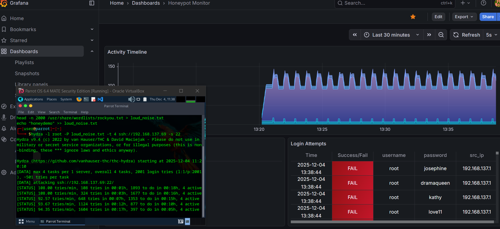

# raspberry-pi-cyber-range
# IoT-Based Cybersecurity Lab & Threat Simulation Environment

## 📌 Project Overview
This repository documents the architecture, deployment, and testing of a 4-node, air-gapped network built entirely on Raspberry Pis. Designed as a practical coursework project at Savonia UAS, this environment serves as an isolated cyber threat simulation lab. The primary goal was to build a functional network, execute common attack vectors, and monitor the resulting traffic using an industry-standard SIEM and IDS stack.

  
   
  <em>Visualizing a Hydra brute-force attack in real-time. The chart shows the spike in login activity, while the table details the failed attempts captured by the SOC stack.</em>

## 🏗️ Architecture & Topology
The environment is physically air-gapped and consists of four main nodes:
* **Node 1 (Router/AP):** Configured as the network backbone.
* **Node 2 (Target):** Hosts vulnerable services (Nginx web service, SSH, Telnet).
* **Node 3 (Attacker):** Dedicated attack machine used to launch scripts and payloads.
* **Node 4 (Defense/SOC):** Houses the SIEM and IDS stack for log ingestion and alerting.

## 🛠️ Technology Stack
**Hardware:**
* 4x Raspberry Pi (Headless setup)
* Isolated/Air-gapped networking hardware

**Software & Tools:**
* **IDS/Monitoring:** Suricata, EveBox
* **SIEM Stack:** PLG (Promtail, Loki, Grafana)
* **Target Services:** Nginx, SSH, Telnet
* **Offensive Tools:** ParrotOS, Hydra, Nmap, custom SQLi scripts

## ⚔️ Simulated Attacks & Detection
The following scenarios were successfully executed by the attacker node and successfully logged/detected by the defense node:

1.  **Reconnaissance / Network Scanning:**
    * *Attack:* Nmap scans to map open ports on the target node.
    * *Detection:* Suricata rules triggered, alerts visualized in EveBox.
2.  **Brute-Force (Hydra):**
    * *Attack:* Dictionary-based brute-force attack targeting Telnet and SSH ports on the target node.
    * *Detection:* Failed login spikes ingested by Promtail, stored in Loki, and visualized on Grafana dashboards.
3.  **Web Exploitation (SQLi):**
    * *Attack:* Foundational SQL injection attack against the Nginx-hosted web application.
    * *Detection:* Web server error logs and malicious payload signatures captured and alerted via the SIEM/IDS stack.

## Key Takeaways
This project provided hands-on experience in both offensive execution and defensive monitoring. It demonstrated the complexities of routing traffic in an isolated hardware environment and the importance of centralized logging for rapid incident response. 
*(Note: As this was an academic project, specific configuration files and network credentials have been omitted for security and academic integrity).*
